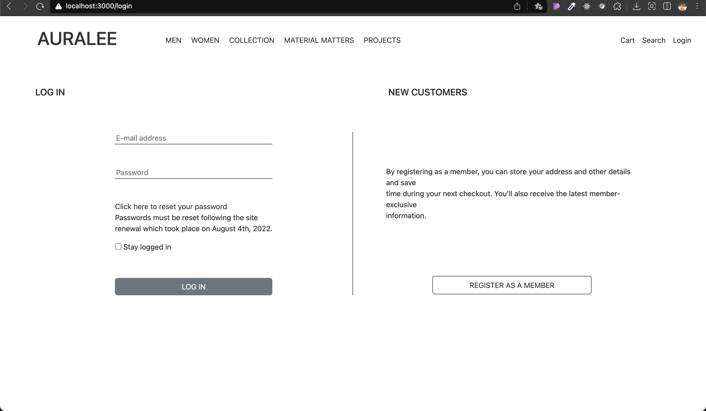
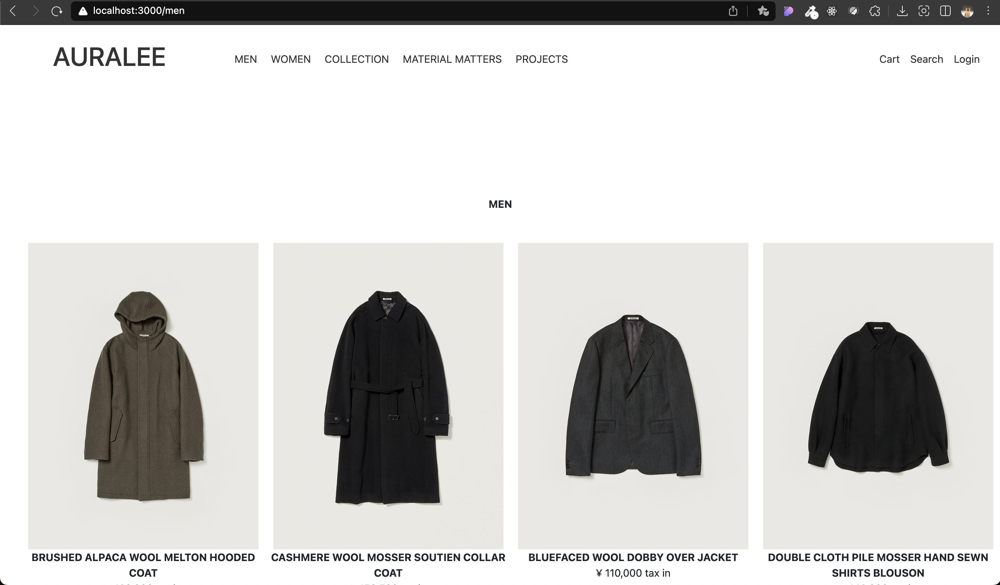

# AURALEE

## 실행 방법

1. cd auralee

2. npm i

3. npm start

## 구현 내역

- 2023.12.14
  - 화면: 홈, 로그인, 남성 의류
  - 기능: collection, login, material-matters, men, projects, women 라우팅

## 구현 화면

### 홈

### 로그인

### 남성 의류

